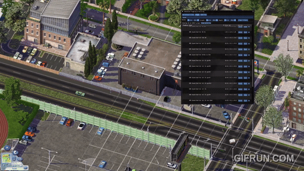

# SC4 Plop and Paint

SC4 Plop and Paint is a SimCity 4 plugin that adds an in-game panel for browsing lots, painting props, and building reusable weighted prop families.

## What it does

`SC4PlopAndPaint.dll` adds an in-game window called `Advanced Plopping & Painting`. Press `O` in a loaded city to open it. The window is split into three tabs: `Buildings & Lots` for browsing and plopping lots, `Props` for painting individual props, and `Families` for managing and painting weighted random prop sets.

[](https://youtu.be/R7z5wg1KB7E)

_Short demo clip. Click the animation to watch the full video on YouTube._


`_SC4PlopAndPaintCacheBuilder.exe` scans your SimCity 4 plugin directories, parses exemplar and cohort data, and writes `lot_configs.cbor` and `props.cbor` into your Plugins folder. The DLL reads those cache files when the city loads, which is why rebuilding the cache matters whenever your plugin collection changes.

## Installation

Install SC4 Render Services first, then download `SC4PlopAndPaint-{version}-Setup.exe` from the releases page and run it. The installer will:

1. Ask for your game root and Plugins directory.
2. Verify that `SC4RenderServices.dll` is already present in your Plugins folder.
3. Place `SC4PlopAndPaint.dll` and `SC4PlopAndPaint.dat` in your Plugins folder.
4. Place `_SC4PlopAndPaintCacheBuilder.exe` and a generated `Rebuild-Cache.ps1` in `Documents\SimCity 4\SC4PlopAndPaint\`.
5. Optionally run the cache builder immediately.

Required runtimes:

- Visual C++ 2015-2022 Redistributable (x86, required for SimCity 4 / 32-bit): `https://aka.ms/vs/17/release/vc_redist.x86.exe`
- Visual C++ 2015-2022 Redistributable (x64): `https://aka.ms/vs/17/release/vc_redist.x64.exe`

To rebuild the cache later, for example after adding or removing plugins, run `Rebuild-Cache.ps1`.

If something looks wrong in game, check the separate services plugin's log output in `Documents\SimCity 4\`.

## Using it in-game

For the full player guide, including tab-by-tab controls, paint and strip hotkeys, screenshots, and example use cases, see [docs/USAGE.md](docs/USAGE.md).

Quick summary:

- `Buildings & Lots` is for browsing and plopping lots, including growables you want to place manually
- `Props` is for browsing props, painting a single prop, and removing placed props with strip mode
- `Families` is for building weighted prop palettes and painting with them in direct, line, or polygon mode
- Paint mode supports grid controls, snapping, undo, line placement, polygon fills, and a live in-world status window

If you just want the basics:

1. Load a city and open the panel with the toggle shortcut (packaged default: `O`)
2. Use `Paint` from `Props` or `Paint family` from `Families`
3. Choose a mode and options, then press `Start`
4. Use `Enter` to generate and commit placements, `Ctrl+Z` / `Ctrl+Backspace` to undo, and `Esc` to cancel

## Building from source

Clone with submodules:

```bash
git clone --recurse-submodules https://github.com/caspervg/sc4-advanced-plop
cd sc4-advanced-plop
```

**DLL (32-bit, Windows only - required for SC4):**

```bash
cmake --preset vs2022-win32-release
cmake --build --preset vs2022-win32-release-build --target SC4PlopAndPaint
```

**Cache builder CLI (64-bit, Windows):**

```bash
cmake --preset vs2022-x64-release
cmake --build --preset vs2022-x64-release-build --target SC4PlopAndPaintCli
```

**macOS / Linux (CLI only):**

```bash
cmake --preset ninja-release
cmake --build --preset ninja-release-build
```

Use `ninja-debug`, `vs2022-win32-debug`, or `vs2022-x64-debug` for debug builds.

Dependencies are managed via vcpkg (bundled in `vendor/vcpkg`). On Windows, the CI workflow also builds `sc4-imgui-service` separately before packaging the release artifact.

**Running tests:**

```bash
ctest -C Debug --test-dir cmake-build-debug-visual-studio --output-on-failure
```

## Third-party code

| Library | Purpose | License |
|---|---|---|
| [sc4-render-services](https://github.com/caspervg/sc4-render-services) | ImGui backend and SC4 custom services integration | LGPL 2.1 |
| [gzcom-dll](https://github.com/nsgomez/gzcom-dll) | GZCOM interface headers for SC4 plugin development | LGPL 2.1 |
| [DBPFKit](https://github.com/caspervg/DBPFKit) | DBPF archive reader (exemplars, FSH, S3D, LText) | - |
| [Dear ImGui](https://github.com/ocornut/imgui) | Immediate-mode UI framework | MIT |
| [reflect-cpp](https://github.com/getml/reflect-cpp) | Compile-time reflection and CBOR/JSON serialization | MIT |
| [spdlog](https://github.com/gabime/spdlog) | Structured logging | MIT |
| [args](https://github.com/Taywee/args) | CLI argument parsing | MIT |
| [pugixml](https://github.com/zeux/pugixml) | XML parsing (PropertyMapper) | MIT |
| [yyjson](https://github.com/ibireme/yyjson) | Fast JSON parsing (reflect-cpp backend) | MIT |
| [stb](https://github.com/nothings/stb) | Image decoding/encoding | MIT / Public Domain |
| [WIL](https://github.com/microsoft/wil) | Windows Implementation Library helpers | MIT |
| [libsquish](https://sourceforge.net/projects/libsquish/) | DXT texture decompression | MIT |
| [mio](https://github.com/mandreyel/mio) | Memory-mapped file I/O | MIT |
| [jsoncons](https://github.com/danielaparker/jsoncons) | JSON/CBOR processing | Boost 1.0 |
| [utfcpp](https://github.com/nemtrif/utfcpp) | UTF-8 string utilities | Boost 1.0 |
| [ctre](https://github.com/hanickadot/compile-time-regular-expressions) | Compile-time regular expressions | Apache 2.0 |
| [raylib](https://www.raylib.com) | 3D rendering for thumbnail generation | zlib |
| [GLFW](https://www.glfw.org) | OpenGL windowing (raylib dependency) | zlib |

Full license texts are in [dist/ThirdPartyNotices.txt](dist/ThirdPartyNotices.txt).
