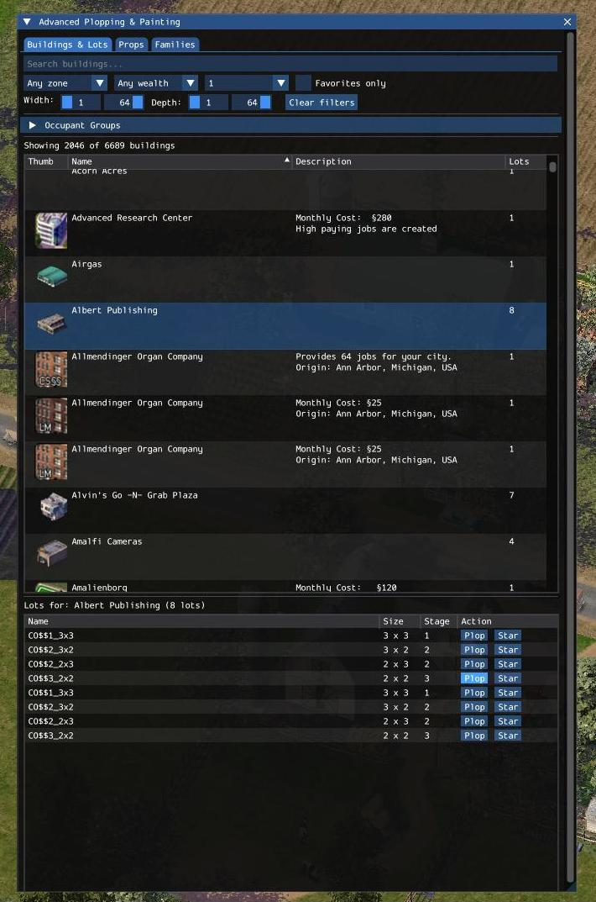
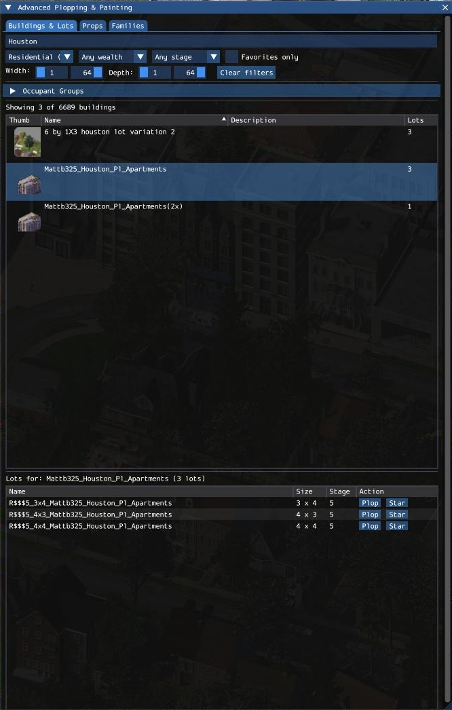
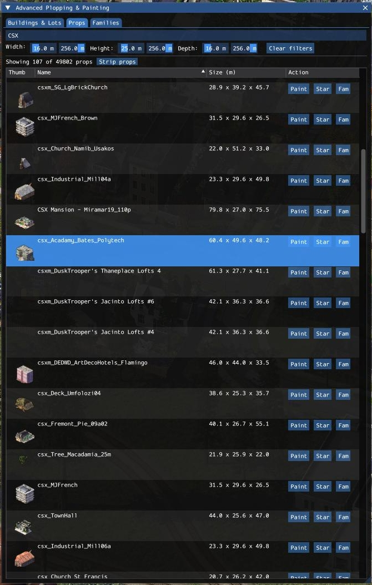
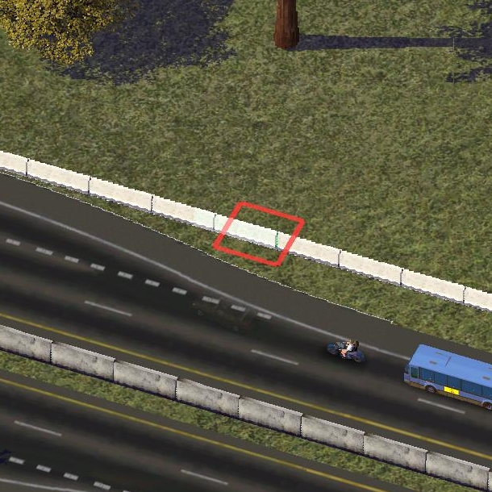
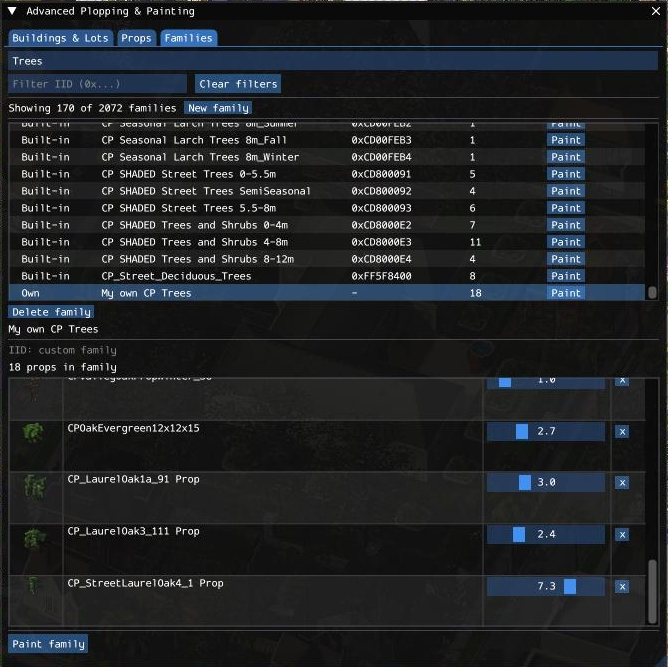
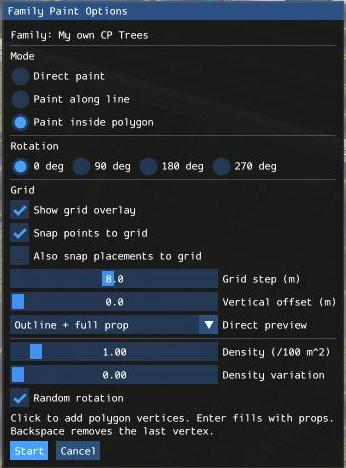
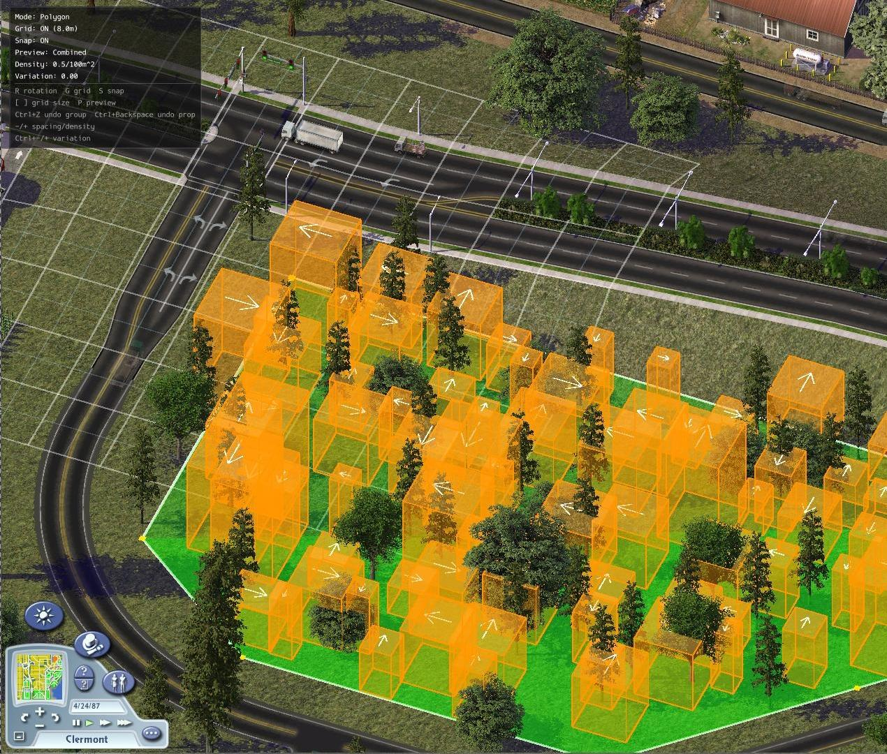

# Using SC4 Plop and Paint In-Game

This guide is written for players, not developers. It covers the full in-game flow after installation and after the cache has been built.

## Before you start

1. Run the cache builder if you have added, removed, or changed plugins.
2. Start SimCity 4 and load a city.
3. Press the panel toggle shortcut to open the `Advanced Plopping & Painting` window. The packaged default is `O`.

If the panel opens but the lists are empty, `Buildings & Lots` is missing `lot_configs.cbor`, or `Props` / `Families` are missing `props.cbor`.

The main window can be closed either with the same toggle shortcut or with the window close button.

## The main window

The window has three tabs:

- `Buildings & Lots`: browse buildings and plop lots
- `Props`: browse props, paint a single prop, and remove placed props
- `Families`: manage built-in and custom prop families, then paint with a weighted random palette

The main panel with all three tabs available in a loaded city.

## Buildings & Lots

This tab is for finding and plopping lots.

Filters:

- `Search buildings...`: matches both building names and lot names
- Zone: `Any zone`, `Residential (R)`, `Commercial (C)`, `Industrial (I)`, `Plopped`, `None`, `Other`
- Wealth: `Any wealth`, `$`, `$$`, `$$$`
- Growth stage: `Any stage`, `Plopped (255)`, `0` through `15`
- `Favorites only`
- `Width` and `Depth` min/max sliders
- `Occupant Groups`: expandable tree filter with `Clear OGs`
- `Clear filters`: resets all of the above

Important behavior:

- Filtering is lot-based, but the list shows buildings. A building stays visible if any of its lots matches the current filters.
- The upper table lists buildings. Single-click selects one.
- Double-clicking a building row auto-plops only when that building has exactly one lot.
- The lower table shows the selected building's lots.

Lot actions:

- Double-click a lot row to plop it
- Press `Plop` to plop it
- Use `Star` / `Unstar` to manage lot favorites

The lot browser with filters, building results, and the selected building's lot list.

## Props

This tab is for individual props and prop removal.

Filters:

- `Search props...`
- `Favorites only`
- Width, height, and depth min/max sliders
- `Clear filters`

Per-prop actions:

- `Paint`: start painting that prop, or switch the active paint tool to that prop if you are already painting
- `Star` / `Unstar`: manage prop favorites
- `Fam`: add the prop to one of your custom families

If you hover a prop name and it belongs to built-in families, the tooltip shows those family IDs and names.

Strip mode:

- `Strip props`: enters prop removal mode
- `Stop stripping`: exits strip mode from the tab
- In strip mode, click props in the city to delete them one by one
- `Ctrl+Z` restores the most recently removed prop
- `Esc` or right-click exits strip mode

The props browser, including `Paint`, favorites, family assignment, and strip mode access.

Strip mode highlights props in the city so you can remove them one by one and undo mistakes.

## Families

This tab combines built-in families from the cache with your own custom families.

Filters and top actions:

- `Search family name...`
- `Filter IID (0x...)`
- `Clear filters`
- `New family`
- `Stop painting` while paint mode is active

Family list:

- `Built-in` families are read-only and show their instance IDs
- `Own` families are your editable custom families
- Double-click a family row or press `Paint` to open the family paint options

Custom family management:

- Create a family with `New family`
- Delete the selected custom family with `Delete family`
- Add props from the `Props` tab using `Fam`
- Adjust entry `Weight` values to bias random selection
- Remove entries with the `x` button

Built-in families cannot be edited.

Custom families let you manage weighted prop palettes before painting with them.

## Favorites

Favorites are there to reduce repeated searching.

In `Buildings & Lots`, press `Star` on a lot to save it and `Unstar` to remove it. Turning on `Favorites only` limits the visible list to your saved lot favorites that still match the other filters.

In `Props`, `Star`, `Unstar`, and `Favorites only` work the same way for props.

Favorites are stored by the plugin and persist between sessions.

## Creating and managing your own families

Custom families are your own weighted random prop palettes.

To create one, open `Families`, press `New family`, enter a name, and press `Create`. The new family starts empty.

The fastest way to add props to a family is from the `Props` tab: find a prop, press `Fam`, and choose the destination family from the popup. Once a family has members, return to `Families` to review and edit it.

When a custom family is selected, you can delete it, change each entry's weight, and remove individual entries with the `x` button. Higher weights make an entry more likely to be chosen during family painting.

Built-in families (i.e. provided by Maxis or custom content creators) are read-only. Custom families are editable.

## Starting paint mode

Painting can be started from the `Props` tab for a single fixed prop or from the `Families` tab for a weighted random family. Before the tool activates, a popup lets you choose the paint settings.

Common options:

- `Mode`: `Direct paint`, `Paint along line`, or `Paint inside polygon`
- `Rotation`: fixed 0 / 90 / 180 / 270 degrees
- `Show grid overlay`: shows the preview grid on the terrain
- `Snap points to grid`: snaps the points you click to the grid
- `Also snap placements to grid`: snaps final placed props to the grid as well
- `Grid step (m)`: grid size in meters
- `Vertical offset (m)`: raises placed props and the preview above the terrain
- `Direct preview`: `Outline only`, `Full prop only`, or `Outline + full prop`

Mode-specific options:

- Line mode: `Spacing (m)`, `Align to path direction`, `Random rotation`, and `Lateral jitter (m)`
- Polygon mode: `Density (/100 m^2)`, `Density variation`, and `Random rotation`

Polygon notes:

- `Density` currently ranges from `0.1` to `10.0` per `100 m^2`
- `Density variation` ranges from `0.0` to `1.0`
- `Density variation` controls how uniform or patchy the fill looks: `0` is more even, `1` creates more clusters and gaps

When painting with a family, each placed prop is chosen from that family using its saved weights.

The paint options popup, shown here in polygon mode with density and density variation controls.

## How the paint tool works

After you press `Start`, the paint tool takes over map input until you commit or cancel.

In `Direct paint`, left-click places one prop at a time.

In `Paint along line`, left-click adds line points and `Enter` places props along the path.

In `Paint inside polygon`, left-click adds polygon vertices and `Enter` fills the area.

In line and polygon modes, the first `Enter` generates the batch and places it as pending props. Press `Enter` again to commit those pending props permanently.

Polygon paint mode in action, with the live overlay preview and the status window visible on the map.

## Paint tool controls

While paint mode is active:

- `R`: rotate the fixed rotation (cycles 0 / 90 / 180 / 270)
- `G`: toggle the grid overlay
- `S`: toggle point snapping (turning it off also disables placement snapping)
- `[` / `]`: step the grid size through preset values (`1`, `2`, `4`, `8`, `16` meters)
- `P`: cycle preview mode (`Outline`, `Full`, `Combined`, `Hidden`)
- `Backspace`: remove the last unconfirmed line point or polygon vertex while drawing
- `Ctrl+Z`: undo the whole last pending placement group
- `Ctrl+Backspace`: undo only the last prop in the current top group
- `Enter`: place the current line or polygon batch, or commit pending placements
- `Esc` or right-click: cancel all pending placements and leave paint mode

Mode-specific hotkeys:

- Line mode: `-` / `+` decrease or increase spacing by `0.5m`
- Polygon mode: `-` / `+` decrease or increase density by `0.25`
- Polygon mode: `Ctrl+-` / `Ctrl++` decrease or increase density variation by `0.05`

While painting, a small status window also shows up to help you out and to mirror the main paint hotkeys for quick reference.

## What "pending placements" means

Painted props are first placed in a temporary highlighted state. They are visible immediately, but they are still considered pending until you commit them. While they are pending, you can undo them. Press `Enter` to commit everything currently pending, or press `Esc` to remove all pending placements instead.

That means even in direct mode there are usually two stages: you click to place one or more props, then you press `Enter` when you are satisfied and want to make them final.

## Typical flows

**Plop a lot**

1. Press the panel toggle shortcut (default `O`).
2. Open `Buildings & Lots`.
3. Filter until you find the building or lot you want.
4. Double-click the lot row or press `Plop`.

**Paint one prop repeatedly**

1. Press the panel toggle shortcut (default `O`).
2. Open `Props`.
3. Find the prop and press `Paint`.
4. Choose `Direct paint` or another mode and set the options you want.
5. Press `Start`.
6. Click to place props.
7. Use `Ctrl+Z` or `Ctrl+Backspace` if needed.
8. Press `Enter` to commit, or `Esc` to cancel.

**Paint a row of props**

1. Start from `Props` or `Families`.
2. Choose `Paint along line`.
3. Press `Start`.
4. Click each control point along the line.
5. Press `Enter` to generate the placements.
6. Press `Enter` again to commit them, or undo or cancel instead.

**Paint a filled area**

1. Start from `Props` or `Families`.
2. Choose `Paint inside polygon`.
3. Set `Density`, `Density variation`, and any other options you want.
4. Press `Start`.
5. Click each polygon vertex.
6. Press `Enter` to fill the area.
7. Press `Enter` again to commit, or use undo if needed.

**Paint a random family**

1. Open `Families`.
2. Select or create a family.
3. Adjust the family weights if needed.
4. Press `Paint family`.
5. Choose a mode and options.
6. Paint as normal; each placement will be chosen from the family.

## Example use cases

**Replace repeated manual lot searching**

If you keep using the same transit, utility, landmark, or decoration lots:

1. Find them once in `Buildings & Lots`.
2. Mark them with `Star`.
3. Turn on `Favorites only` later when you want a short working list.

This is useful when your Plugins folder is large and you want a compact set of go-to lots.

**Plop lots that are normally only seen as growables**

The lot browser is useful even when you are not sure how a building is normally obtained in gameplay:

1. Open `Buildings & Lots`.
2. Filter by zone, wealth, growth stage, size, or occupant groups.
3. Find a lot that would normally only appear as a growable.
4. Double-click it or press `Plop` to place it directly.

This makes it easier to use growable-content lots intentionally in custom cities, test setups, or showcase regions.

**Discover content you forgot you installed**

The browsing tabs can also be used as a discovery tool:

1. Open `Buildings & Lots`, `Props`, or `Families`.
2. Search loosely by theme, size, or category instead of by exact name.
3. Browse thumbnails, family tooltips, and filtered lists.
4. Use `Star` to save anything you want to come back to later.

This is useful when you have a large Plugins collection and want to rediscover buildings, lots, or props you did not remember having.

**Lay out fences, hedges, or roadside details quickly**

Use `Paint along line` when you want a clean repeated sequence along a street, path, or lot edge:

1. Start from `Props` or `Families`.
2. Choose `Paint along line`.
3. Set `Spacing`, `Align to path direction`, and optional `Lateral jitter`.
4. Click the control points along the route.
5. Press `Enter` to generate the row, then `Enter` again to commit.

This works well for fences, bollards, lamps, benches, and other evenly spaced props.

**Place road signs, highway signs, or sound barriers along a route**

Line paint is also useful for transportation detailing where orientation and spacing matter:

1. Start from `Props` for one repeated asset, or `Families` for a small themed set.
2. Choose `Paint along line`.
3. Turn on `Align to path direction`.
4. Adjust `Spacing` until the preview matches the rhythm you want.
5. Click along the road, ramp, or highway edge.
6. Press `Enter` to generate the run, then `Enter` again to commit.

This is a good fit for roadside signs, gantry-adjacent details, retaining props, and repeated sound barriers.

**Fill parks, medians, or vacant corners with less repetitive clutter**

Use `Paint inside polygon` when you want to cover an area instead of drawing a single line:

1. Start from `Props` for one repeated prop, or `Families` for a mixed palette.
2. Set `Density` for overall coverage.
3. Set `Density variation` higher if you want more natural clumps and gaps.
4. Click the polygon outline.
5. Press `Enter` to generate the fill, then `Enter` again to commit.

This is the fastest way to block in planters, shrubs, rocks, debris, or plaza furniture across an irregular shape.

**Dress up industrial or port areas with mixed clutter**

Custom families and polygon fill work well for cargo-heavy scenes:

1. Create a family for containers, pallets, crates, drums, or similar props.
2. Add matching entries from the `Props` tab with `Fam`.
3. Raise the `Weight` of the props you want to dominate the mix.
4. Start painting from `Families` with `Paint inside polygon`.
5. Tune `Density` and `Density variation` until the preview looks believable.
6. Fill warehouse yards, loading areas, docks, or fenced industrial corners.

This is an efficient way to create busy-looking industry and port spaces without hand-placing every single object.

**Build a reusable random palette for one theme**

If you often place the same style of clutter together, create a custom family:

1. Create a family in `Families`.
2. Add matching props from the `Props` tab with `Fam`.
3. Increase the `Weight` of the props you want to appear more often.
4. Paint with that family in direct, line, or polygon mode.

This is useful for themed sets like street furniture, industrial clutter, plaza details, or shoreline props.

**Remove mistakes without restarting the whole pass**

When painting or stripping, you do not need to stop and start over for small corrections:

1. While painting, use `Ctrl+Z` to remove the most recent group, or `Ctrl+Backspace` to trim the last prop from that group.
2. While stripping, use `Ctrl+Z` to restore the most recently removed prop.
3. Use `Esc` if you want to abandon the current paint batch or leave strip mode.

This makes it practical to work iteratively instead of treating each pass as all-or-nothing.

## Stopping paint mode

Press `Esc` to cancel pending placements and leave paint mode immediately. If you reopen the panel while painting, the `Props` and `Families` tabs also show a `Stop painting` button.
